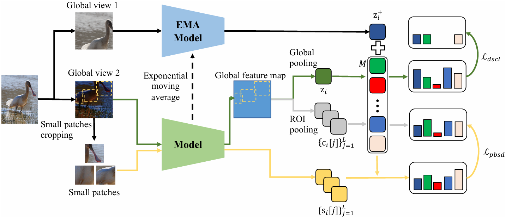

# DSCL
Pytorch implementation of Paper ["Decoupled Contrastive Learning for Long-Tailed Recognition"](https://ojs.aaai.org/index.php/AAAI/article/view/28459/28894) (AAAI 2024)



## Installation
### 1. Clone code
```
    git clone https://github.com/SY-Xuan/DSCL.git
    cd ./DSCL
```

### 2. Install Package
```
conda create -n pink python=3.10 -y
conda activate pink
pip install --upgrade pip # enable PEP 660 support
pip install -e .
```

## Train
### 1. Representation Learning
You need to download ImageNet and change the data path in the train.sh. We use 2 RTX 3090.
```
sh ./train.sh
```

### 2. Classifier Learning
You need to change the checkpoint path in the train_cls.sh. We use 2 RTX 3090.
```
sh ./train_cls.sh
```

## Citations
If you find this code useful for your research, please cite our paper:

```
@inproceedings{xuan2024decoupled,
  title={Decoupled Contrastive Learning for Long-Tailed Recognition},
  author={Xuan, Shiyu and Zhang, Shiliang},
  booktitle={Proceedings of the AAAI Conference on Artificial Intelligence},
  volume={38},
  number={6},
  pages={6396--6403},
  year={2024}
}
```
## Contact me
If you have any questions about this code or paper, feel free to contact me at
shiyu_xuan@stu.pku.edu.cn.

## Acknowledgement
Codes are built upon [moco](https://github.com/facebookresearch/moco) and [targeted-supcon](https://github.com/LTH14/targeted-supcon). Thanks for these outstanding implementations.
